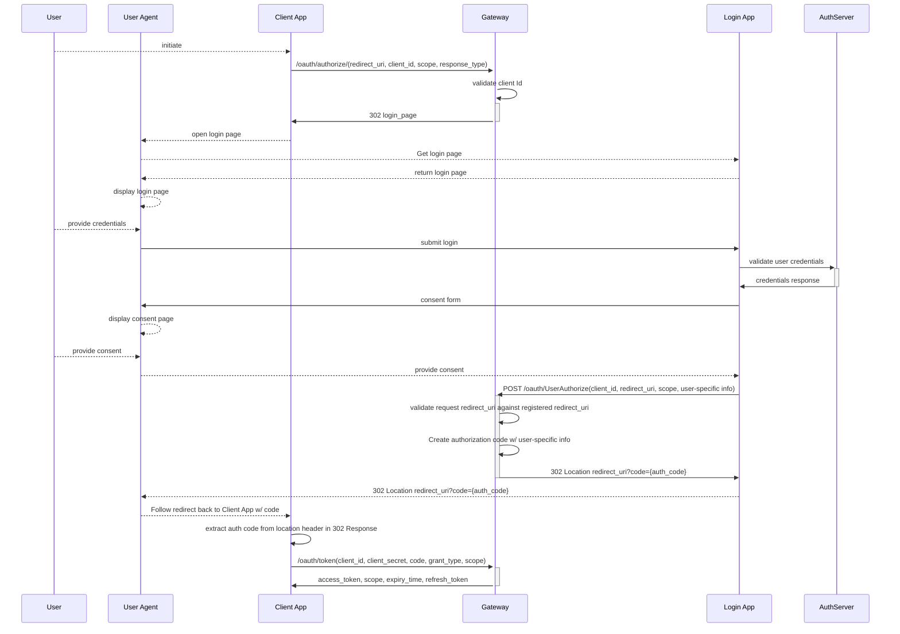

```mermaid
sequenceDiagram
  participant User
  participant User Agent
  participant Client App
  participant Gateway
  participant Login App
  participant AuthServer

  User-->>Client App: initiate
  Client App->>+Gateway: /oauth/authorize/(redirect_uri, client_id, scope, response_type)
  Gateway->>+Gateway: validate client Id
  Gateway->>-Client App: 302 login_page
  Client App-->>User Agent: open login page

  User Agent-->>Login App: Get login page
  Login App-->>User Agent: return login page

  User Agent-->>User Agent: display login page

  User-->>User Agent: provide credentials
  User Agent->>Login App: submit login
  Login App->>+AuthServer: validate user credentials
  AuthServer->>-Login App: credentials response

  Login App->>User Agent: consent form
  User Agent-->>User Agent: display consent page
  User-->>User Agent: provide consent

  User Agent-->>Login App: provide consent
  Login App->>+Gateway: POST /oauth/UserAuthorize(client_id, redirect_uri, scope, user-specific info)
  Gateway->>Gateway: validate request redirect_uri against registered redirect_uri
  Gateway->>Gateway: Create authorization code w/ user-specific info
  Gateway->>-Login App: 302 Location redirect_uri?code={auth_code}
  Login App-->>User Agent: 302 Location redirect_uri?code={auth_code}

  User Agent-->>Client App: Follow redirect back to Client App w/ code
  Client App->>Client App: extract auth code from location header in 302 Response

  Client App->>+Gateway: /oauth/token(client_id, client_secret, code, grant_type, scope)
  Gateway->>-Client App: access_token, scope, expiry_time, refresh_token

```
